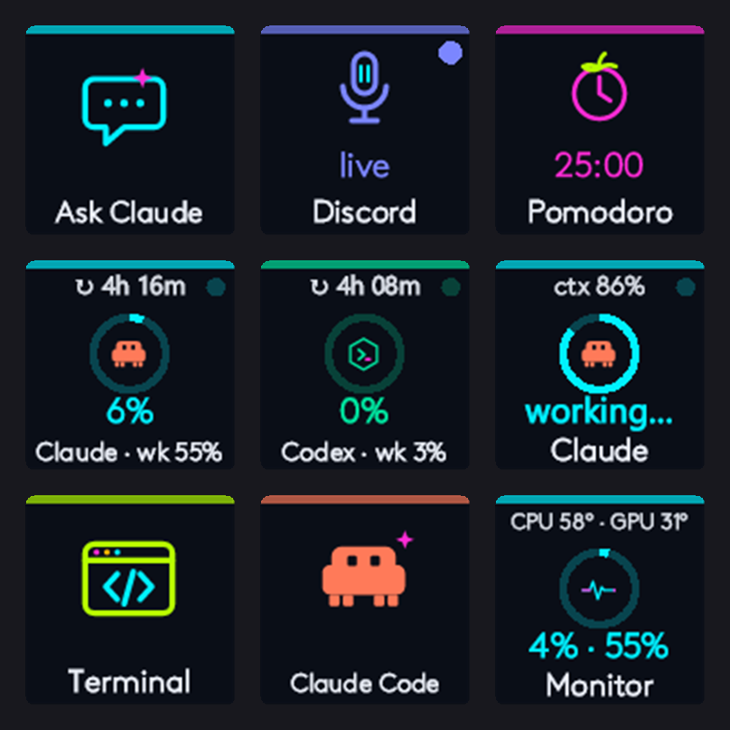
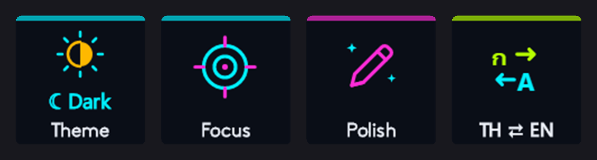
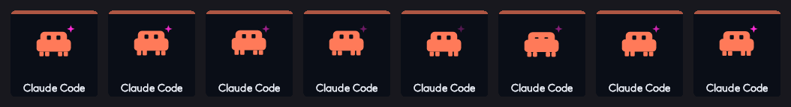

# Neon Deck — a live, AI‑native command deck for the Logitech MX Creative Keypad

A [Logi Actions SDK](https://logitech.github.io/actions-sdk-docs/) plugin (C#, .NET 10) that turns the nine LCD keys of the Logitech MX Creative Keypad into a neon‑styled dashboard for people who live in Claude Code, Codex and Discord: quota meters with reset countdowns, a physical status light for Claude Code, a Discord mic toggle that needs no keybinds, a Pomodoro with an on‑key countdown, a CPU/RAM/GPU monitor with temperatures, and one‑press dev launchers. Every key face is drawn live by the plugin.



*Actual 116 px key faces rendered by the plugin while Claude was working.*

---

## Contents

1. [What it does](#what-it-does)
2. [Requirements](#requirements)
3. [Install](#install) — plugin · key layout · Claude Code integration · LibreHardwareMonitor
4. [Configuration](#configuration)
5. [Customizing](#customizing) — labels, colors, icons · face layout · per‑key behavior · adding a key · testing without the device
6. [Code map](#code-map)
7. [Troubleshooting](#troubleshooting)
8. [Lessons for Logi Actions SDK authors](#lessons-for-logi-actions-sdk-authors)

---

## What it does

| | | |
|---|---|---|
| **Ask Claude**<br>Sends the clipboard text to Claude and shows a short answer as a notification (also copied to the clipboard). Face shows thinking / ✓. | **Discord Mic**<br>Toggles Discord's own mute. No keybind setup, no focus stealing. The key stays red while muted and always matches Discord's real state. | **Pomodoro**<br>mm:ss countdown with a progress ring on the key, turns red under 5 minutes, press again to cancel. |
| **Claude Usage**<br>Live Claude plan usage: ring + big number = 5‑hour window, label = weekly, corner = time until reset. | **Codex Usage**<br>Same meter for Codex. Asks Codex itself (`codex app-server`) at start‑up, every 10 minutes and on press, and follows Codex's session logs while you use it. | **Claude Live**<br>Status light for Claude Code: cyan breathing = working, green DONE = your turn, amber blinking = Claude is asking you something (permission prompt or a question). Ring = context used. Press to bring the Claude terminal to the front. |
| **Terminal**<br>Opens Windows Terminal and VS Code in your project folder. | **Claude Code**<br>Opens a terminal and runs `claude` in the project. Clawd idles on the key: bobbing, walking in place, blinking (8 frames, 4 fps). | **Monitor**<br>CPU% ring, CPU · RAM numbers, "CPU 58° · GPU 32°" temperatures on one line in the corner. Press for disk, uptime, IP and GPU details. |

Also available but not on the default page (drag them onto a key in Options+): **Theme** (toggle Windows dark/light), **Focus** (mute notifications and minimize everything but the active window), **Polish** (Claude rewrites the selected text and pastes it back), **TH ⇄ EN** (Thai ↔ English translation of the selection, pasted back).





The quota keys and Claude Live carry a small breathing dot in the top‑right corner so you can see they are alive, and their frame flashes for three seconds whenever a new number arrives.

---

## Requirements

| | |
|---|---|
| Device | Logitech MX Creative Keypad (`Loupedeck70` inside the Plugin Service; one 480×480 panel split into nine 118 px keys) |
| Logitech software | Logi Options+ 2.7+ with Logi Plugin Service 6.4+ (installed together with Options+) |
| Build | **.NET 10 SDK** — `winget install Microsoft.DotNet.SDK.10`. Plugin Service 6.4.1 compiles `PluginApi.dll` against .NET 10; the .NET 8 target from Logitech's docs fails with CS1705. |
| AI keys (Ask Claude / Polish / TH ⇄ EN) | [Claude Code CLI](https://docs.anthropic.com/claude-code) signed in, `claude` on PATH |
| Claude Usage / Claude Live | Node.js 18+ for the scripts in `tools/claude/`, configured as described in [Install › Claude Code](#3-claude-code-integration) |
| Codex Usage | Codex CLI or app installed and signed in (`codex.exe` is auto‑detected; set `codexExe` in `deck.config.json` if it lives elsewhere) |
| Monitor (CPU temperature) | [LibreHardwareMonitor](https://github.com/LibreHardwareMonitor/LibreHardwareMonitor), see [Install › LibreHardwareMonitor](#4-cpugpu-temperatures-with-librehardwaremonitor) (without it the key still shows the GPU via `nvidia-smi`) |
| Discord Mic | Discord desktop running (nothing to configure inside Discord) |

Windows 11 only (Core Audio, UI Automation and Windows toast notifications are used).

---

## Install

### 1. Plugin

```bash
git clone https://github.com/k12club/neon-deck.git
cd neon-deck/NeonDeckPlugin
dotnet build -c Debug
```

`dotnet build` compiles, writes `NeonDeckPlugin.link` into `%LOCALAPPDATA%\Logi\LogiPluginService\Plugins\` pointing at `bin\Debug\`, and asks the Plugin Service to reload the plugin through `loupedeck://plugin/NeonDeck/reload`. Open Logi Options+ → MX Keypad → **All actions**: the groups *Neon Deck | AI*, *Neon Deck | Workspace* and *Neon Deck | Dev* appear.

If they do not show up, restart the Plugin Service (Options+ → Settings → Restart plugin service, or `Stop-Process LogiPluginService -Force`; Options+ relaunches it within about six seconds).

To package an installer for another machine:

```bash
dotnet tool install --global LogiPluginTool      # once
dotnet build -c Release
logiplugintool pack ./bin/Release ./NeonDeck.lplug4   # double‑click on the target machine
```

### 2. Key layout

**Normal way:** in Options+ → MX Keypad, drag actions from All actions onto the keys.

**Whole page at once** (what this repo does): edit the Options+ profile directly.

1. Back up `%LOCALAPPDATA%\Logi\LogiPluginService\Applications\Loupedeck70\@_defaultwin\Profiles\<id>\ProfileInfo.json`.
2. Stop the service with `Stop-Process LogiPluginService -Force` and edit the file right away (Options+ restarts the service in about six seconds).
3. In `layout.layoutModes[0].workspaces[0].pressPages` insert a new page first, with nine `controls` (`controlId` 0–8, left→right, top→bottom) whose `pressAction` is `$NeonDeck___Loupedeck.NeonDeckPlugin.<ClassName>`, e.g. `$NeonDeck___Loupedeck.NeonDeckPlugin.PomodoroCommand`.
4. Add `"NeonDeck"` to `additionalNativePluginNames`.

Class names: `AskClaudeCommand` `DiscordMicCommand` `PomodoroCommand` `ClaudeUsageCommand` `CodexUsageCommand` `ClaudeLiveCommand` `DevCockpitCommand` (Terminal) `ClaudeCodeHereCommand` `SysPulseCommand` (Monitor) `ThemeFlipCommand` `FocusModeCommand` `PolishTextCommand` `TranslateFlipCommand`

### 3. Claude Code integration

**Claude Usage** and **Claude Live** read what Claude Code already knows locally while it is running. Claude Usage only talks to Anthropic itself when that local data is stale, typically right after boot (see below).

```powershell
copy tools\claude\neon-statusline.js  $env:USERPROFILE\.claude\
copy tools\claude\neon-claude-hook.js $env:USERPROFILE\.claude\
```

Then add to `~/.claude/settings.json` (replace `<you>`, use forward slashes):

```jsonc
{
  "statusLine": { "type": "command", "command": "node C:/Users/<you>/.claude/neon-statusline.js" },
  "hooks": {
    "UserPromptSubmit": [{ "hooks": [{ "type": "command", "command": "node C:/Users/<you>/.claude/neon-claude-hook.js", "timeout": 5 }] }],
    "PostToolUse":      [{ "hooks": [{ "type": "command", "command": "node C:/Users/<you>/.claude/neon-claude-hook.js", "timeout": 5 }] }],
    "Notification":     [{ "hooks": [{ "type": "command", "command": "node C:/Users/<you>/.claude/neon-claude-hook.js", "timeout": 5 }] }],
    "Stop":             [{ "hooks": [{ "type": "command", "command": "node C:/Users/<you>/.claude/neon-claude-hook.js", "timeout": 5 }] }],
    "SessionStart":     [{ "hooks": [{ "type": "command", "command": "node C:/Users/<you>/.claude/neon-claude-hook.js", "timeout": 5 }] }],
    "SessionEnd":       [{ "hooks": [{ "type": "command", "command": "node C:/Users/<you>/.claude/neon-claude-hook.js", "timeout": 5 }] }]
  }
}
```

- `neon-statusline.js` renders a status line at the bottom of Claude Code (`Fable 5.1 · ctx 12% · 5h 19% · wk 52%`) and mirrors `rate_limits` and `context_window` to `%LOCALAPPDATA%\NeonDeck\claude-status.json`, which **Claude Usage** polls every 15 s.
- `neon-claude-hook.js` records each session's state (working / done / needs_input) in `%LOCALAPPDATA%\NeonDeck\claude-live.json`, which **Claude Live** polls every second. Only `permission_prompt` and `elicitation_dialog` notifications count as *needs you*; Claude Code's `idle_prompt` (\"waiting for your input\" after 60 s of silence) is treated as done/ready.
- Claude Code picks up the settings change without a restart. Numbers appear after the first API response of a session; rate‑limit data exists for Pro/Max plans only.
- Claude Usage falls back to Anthropic's usage endpoint only when the mirror is older than 30 minutes, at most every 15 minutes, backing off 15→30→60 minutes on HTTP 429 (that endpoint rate‑limits aggressively — do not poll it faster). The token is read from `~/.claude/.credentials.json`, sent only to Anthropic, and never logged.
- Claude Code's login token lives 8 hours, so after a reboot it is usually expired. The plugin then renews it the same way Claude Code does (same token endpoint, same OAuth client id) and writes the new token back to `.credentials.json`, so the key shows real numbers right after boot without opening Claude Code first. Claude Code picks the renewed token up by itself. If the renewal is refused (refresh token revoked or past its own limit) the key shows `sign in`: open Claude Code and sign in once.

To remove: delete the `statusLine` key and the hook entries that point at these scripts.

### 4. CPU/GPU temperatures with LibreHardwareMonitor

Windows does not expose CPU temperature (Ryzen in particular) to normal programs, so the Monitor key reads it from LibreHardwareMonitor's Remote Web Server.

```powershell
winget install LibreHardwareMonitor.LibreHardwareMonitor
powershell -ExecutionPolicy Bypass -File tools\lhm\register-task.ps1
```

The script drops `tools/lhm/LibreHardwareMonitor.config` next to the executable (web server on port 8085, start minimized to the tray, 2 s update interval) and registers a Task Scheduler task named **LibreHardwareMonitor (Neon Deck)** that starts at logon with highest privileges (one UAC prompt; the sensor driver needs admin). The plugin reads `http://localhost:8085/data.json` every 10 s and uses the CPU `Core (Tctl/Tdie)` and `GPU Core` sensors.

To remove: `Unregister-ScheduledTask 'LibreHardwareMonitor (Neon Deck)'` then `winget uninstall LibreHardwareMonitor.LibreHardwareMonitor`. The key falls back to the GPU temperature from `nvidia-smi`.

---

## Configuration

`%LOCALAPPDATA%\NeonDeck\deck.config.json` (created on first run; after editing, reload the plugin with `start loupedeck:plugin/NeonDeck/reload` or `dotnet build`)

```json
{
  "projectPath": "E:\\projects\\mx-keypad",
  "pomodoroMinutes": 25,
  "claudeModel": "",
  "claudeCwd": "C:\\Users\\<you>\\AppData\\Local\\NeonDeck",
  "discordMuteHotkey": "",
  "debugSnapshots": false
}
```

| Key | Meaning |
|---|---|
| `projectPath` | Folder opened by the Terminal and Claude Code keys |
| `pomodoroMinutes` | Pomodoro length |
| `claudeModel` | Model for the AI keys; empty = CLI default, `haiku` for the fastest replies |
| `claudeCwd` | Working directory for `claude -p` (neutral, so no project CLAUDE.md leaks into prompts) |
| `discordMuteHotkey` | No longer used; kept for compatibility |
| `codexExe` | Path to `codex.exe` for the live Codex quota; empty = auto‑detect (Codex installer folder, PATH, npm global) |
| `debugSnapshots` | `true` saves every rendered face to `snapshots\*.png` and enables the dev harness (see [testing](#testing-without-the-device)) |

Other files in the same folder: `state.json` (Focus flag etc.), `usage-cache.json` / `usage-backoff.txt` (Claude Usage), `claude-status.json` / `claude-live.json` (written by Claude Code), `lifecycle.log` (plugin load/unload).

---

## Customizing

Every code change ends with `dotnet build -c Debug` in `NeonDeckPlugin` (or keep `dotnet watch build` running in `NeonDeckPlugin/src` for automatic reloads).

### Labels

In the key's file under `src/Actions/`:

- **Text drawn on the key** = `Title` (and `ShortTitle` for the 80 px previews in Options+) in `BuildFace()`.
- **Name in the All actions list** = the first argument of `base(...)` in the constructor, e.g. `base("System Monitor", "...", "Neon Deck | Dev")`; the third argument is the group.

### Colors

The palette lives at the top of `src/Helpers/Neon.cs`: `Bg`, `Text`, `Dim`, `Cyan`, `Magenta`, `Lime`, `Amber`, `Red`, `Coral` (Clawd orange), `Mint` (Codex), `Blurple` (Discord). Change the RGB values there and the whole deck follows. A single key's color is `Accent = Neon.Xxx` in its `BuildFace()`; the thresholds that switch colors by value (amber at 60 %, red at 85 %) are in each key's `Level()` method.

### Icons

- On‑key icons are the SVGs in `src/Resources/` (embedded at build time), referenced by `Icon = "xxx.svg"` in `BuildFace()`. Draw on a 96×96 viewBox with a transparent background and 5–7 px neon strokes; filters/blur are not supported by the renderer.
- Monochrome icons for the Options+ action list live in `src/package/actionsymbols/Loupedeck.NeonDeckPlugin.<ClassName>.svg` (the file name must be the class full name).
- A key may switch icons by state, e.g. `discord_mic_on.svg` / `discord_mic_off.svg`.

### Face layout

`Neon.Draw()` in `src/Helpers/Neon.cs` is the single renderer: top glow bar, corner text (`Corner`), ring (`Progress`), icon, big value (`Subtitle`), bottom label (`Title`), breathing dot (`Heartbeat`), highlighted frame (`Active`). Row heights (0.17–0.20 of the key), icon size and ring stroke are all set there.

### Which key goes where

Drag in Options+ or edit `ProfileInfo.json` as in [Install › Key layout](#2-key-layout). Keys removed from the page remain available in All actions.

### Per‑key behavior

| Key | File | Typical tweaks |
|---|---|---|
| Ask Claude / Polish / TH ⇄ EN | `Actions/AiCommands.cs` | Prompt text passed to `ClaudeCli.Ask(...)`, how long ✓ stays (`Task.Delay(20_500)`) |
| Claude Usage | `Actions/ClaudeUsageCommand.cs`, `Helpers/ClaudeUsageClient.cs` | Mirror poll `LocalPollSeconds`, fallback endpoint interval `EndpointEverySeconds` (keep ≥ 900), backoff, token renewal margin `RenewAhead` |
| Claude Live | `Actions/ClaudeLiveCommand.cs`, `Helpers/ClaudeLiveReader.cs` | Green glow duration `DoneGlow`, session age `SessionTtl`, terminal window regex `ClaudeTitle`, toast on needs_input |
| Codex Usage | `Actions/CodexUsageCommand.cs`, `Helpers/CodexAppServerClient.cs`, `Helpers/CodexUsageReader.cs` | Live ask interval `LiveEverySeconds` / `LiveIfOlderMinutes`, log scan interval `PollEverySeconds`, number of newest log files checked (`Take(5)`) |
| Discord Mic | `Actions/DiscordMicCommand.cs`, `Helpers/DiscordUia.cs` | Localized button names (`MuteNames`), state poll rate (`tick % 3`) |
| Pomodoro | `Actions/WorkspaceCommands.cs` | Length from `pomodoroMinutes`, red threshold (`left.TotalMinutes < 5`) |
| Monitor | `Actions/DevCommands.cs`, `Helpers/LhmTemps.cs` | Sensor names (`Tctl`/`Package`, `GPU Core`), temperature poll (`tick % 10`), details toast (PowerShell in `Execute`) |
| Terminal / Claude Code | `Actions/DevCommands.cs` | Commands launched via `Win.Launch(...)`, e.g. a different terminal |
| Theme / Focus | `Actions/WorkspaceCommands.cs` | Registry keys touched, minimize behavior |

### Adding a key

1. Create `public sealed class XxxCommand : NeonCommand` in `src/Actions/`; the constructor calls `base("List name", "Description", "Neon Deck | Group")`.
2. Implement `BuildFace()` returning a `Neon.Face { Icon, Accent, Title, Subtitle, Progress, Corner, Heartbeat, Active }` (set only what you use).
3. Implement `Execute(String actionParameter)` — what happens on press. Wrap slow work (processes, network) in `this.RunAsync("name", async () => {...})` to get error toasts for free.
4. For live faces, subscribe `this.Deck.Tick += this.OnTick` in `OnLoad()` (fires every second) and call `this.Refresh()` when a value changes; unsubscribe in `OnUnload()`.
5. Add the SVG to `src/Resources/` and a monochrome copy to `src/package/actionsymbols/Loupedeck.NeonDeckPlugin.XxxCommand.svg`.
6. `dotnet build`, then drag the key in Options+ (or add `$NeonDeck___Loupedeck.NeonDeckPlugin.XxxCommand` to ProfileInfo.json).

Helpers available: `Win.Ps(script)` runs PowerShell, `Win.Toast(title, body)`, `Win.GetClipboard()/SetClipboard()`, `Win.SendKeys()`, `Win.Launch(cmd)`, `ClaudeCli.Ask(instruction, input)`, `DeckConfig.Current`, `DeckConfig.GetFlag()/SetFlag()`.

### Testing without the device

Set `"debugSnapshots": true`, reload the plugin, then:

```powershell
$d = "$env:LOCALAPPDATA\NeonDeck"
Set-Content "$d\trigger.txt" 'PomodoroCommand'   # = press that key once
Set-Content "$d\trigger.txt" 'snapshot'          # = re-render every face into snapshots\*.png
```

`snapshots\<icon>_Width116.png` is the face at device size. The plugin log is `%LOCALAPPDATA%\Logi\LogiPluginService\Logs\plugin_logs\NeonDeck.log`. Set the flag back to `false` afterwards, since this mode writes a file on every redraw.

---

## Code map

```
NeonDeckPlugin/src/
  NeonDeckPlugin.cs              Plugin: 1 s ticker for live keys, dev harness (trigger.txt), lifecycle log
  NeonDeckApplication.cs         Empty ClientApplication (the service requires one even for universal plugins)
  Actions/NeonCommand.cs         Base class: renders through Neon, press-only handling with debounce, background work
  Actions/AiCommands.cs          Ask Claude · Polish · TH ⇄ EN
  Actions/ClaudeUsageCommand.cs  Claude Usage (status-line mirror → endpoint fallback, cache, backoff)
  Actions/ClaudeLiveCommand.cs   Claude Live (reads claude-live.json, focuses the terminal)
  Actions/CodexUsageCommand.cs   Codex Usage (codex app-server + session logs)
  Actions/DiscordMicCommand.cs   Discord Mic (UIA + posted click, Core Audio fallback)
  Actions/WorkspaceCommands.cs   Theme · Focus · Pomodoro
  Actions/DevCommands.cs         Terminal · Claude Code · Monitor
  Helpers/Neon.cs                Neon face renderer (BitmapBuilder): ring, heartbeat, corner, labels
  Helpers/Win.cs                 PowerShell runner (-EncodedCommand), toast, clipboard, SendKeys, launcher
  Helpers/ClaudeCli.cs           `claude -p` wrapper
  Helpers/ClaudeUsageClient.cs   Anthropic usage endpoint (fallback) + login token renewal
  Helpers/ClaudeLiveReader.cs    Aggregates Claude Code session states
  Helpers/CodexUsageReader.cs    Reads Codex JSONL logs
  Helpers/CodexAppServerClient.cs Asks Codex for its rate limits (codex app-server, JSON-RPC over stdio)
  Helpers/DiscordUia.cs          Finds and presses Discord's Mute button
  Helpers/MicControl.cs          Core Audio COM interop (IAudioEndpointVolume)
  Helpers/LhmTemps.cs            Reads LibreHardwareMonitor's data.json
  Helpers/DeckConfig.cs          Settings and state
  Resources/*.svg                On-key icons (embedded; hand-drawn, including the Clawd mascot and its 8 idle frames clawd_f0..7)
  package/metadata/              Manifest + DefaultIconTemplate.ict (full-face image so the service adds no label)
  package/actionsymbols/         Monochrome icons for the Options+ action list (file name = class full name)
tools/claude/                    Status-line and hook scripts for ~/.claude
tools/lhm/                       LibreHardwareMonitor config + task registration script
docs/                            Images
(root: index.js, src/, package/)  The original Node.js edition (@logitech/plugin-sdk), kept as a reference. Static icons only.
                                 Do not `npm run link` it together with the C# edition — both are named NeonDeck.
```

---

## Troubleshooting

| Symptom | Fix |
|---|---|
| Build error `CS1705 ... System.Runtime 10.0.0.0` | Use the .NET 10 SDK and `<TargetFramework>net10.0</TargetFramework>` |
| Log says `Cannot load plugin from ...dll` | The service needs a `ClientApplication` subclass in the assembly (`NeonDeckApplication.cs`; do not delete it). After fixing, restart the service: the plugin was put on an in‑memory disabled list. |
| `plugin 'NeonDeck' is already loaded` at service start | Harmless: the service loads it once from the `.link` file and once from the profile. |
| A toggle key seems to do nothing | The keypad delivers press and release; the plugin filters that in `NeonCommand.ProcessButtonEvent2`. New keys must override `Execute()`, not `RunCommand()`. |
| Claude Usage shows `rate limit` | The fallback endpoint returned 429; the key waits out its backoff. With the status line installed (Install › 3) the endpoint is not needed at all. |
| Claude Usage shows `sign in` | The stored login could not be renewed. Open Claude Code and sign in once; the key recovers on its next poll. |
| Codex Usage stays at `…` | `codex.exe` was not found or Codex is not signed in. Check `NeonDeck.log` for `codex: using …`; set `codexExe` in `deck.config.json` or run `codex login`. |
| Claude Live shows `off` | Hooks are not firing. Check `settings.json`, then run `echo {"hook_event_name":"SessionStart","session_id":"t"} \| node ~/.claude/neon-claude-hook.js` and confirm `claude-live.json` appears. Script errors go to `neon-hook-error.log`. |
| Discord Mic shows `in tray` | Discord has no window. Open it once (minimizing to the taskbar is fine; hiding to the tray is not). |
| Monitor has no CPU temperature | LibreHardwareMonitor is not running or its web server is off. `http://localhost:8085/data.json` must return JSON in a browser. |
| Keys blank after editing the profile | Check that `pressAction` matches the class full name exactly and `"NeonDeck"` is in `additionalNativePluginNames`. |

## Lessons for Logi Actions SDK authors

- A C# plugin **must** contain a `ClientApplication` subclass even when it is a universal plugin, otherwise the service only says `Cannot load plugin`.
- The keypad sends `RunCommand` for both press and release (~200 ms apart), so toggle keys undo themselves. Override `ProcessButtonEvent2` and act on `Press` only.
- If you override `GetCommandImage` and draw your own face, ship `metadata/DefaultIconTemplate.ict` with a single `isFullScreen` image item, or the service overlays the action name on your image.
- The Node.js SDK (`@logitech/plugin-sdk` 0.1.x) only offers `onKeyDown()` and static SVG icons. Live faces need C#.
- Chromium/Electron apps (Discord) build no accessibility tree until someone sends `WM_GETOBJECT`, and pressing a button through UIA `Toggle()` activates the window. Posting `WM_LBUTTONDOWN/UP` to the window instead leaves focus alone.
- Anthropic's usage endpoint (`/api/oauth/usage`) rate‑limits hard. Take the numbers from Claude Code's status line instead. Its OAuth access token lives 8 hours; renewing it through `platform.claude.com/v1/oauth/token` with Claude Code's own client id and writing the result back works, and Claude Code carries on with the new token (it watches the file and re‑reads on 401).
- Codex exposes its rate limits through `codex app-server` (`initialize`, then `account/rateLimits/read`): about one second per call, no quota used, no token handling. Much better than scraping session logs.

## Privacy

Nothing leaves the machine except (1) the AI keys, which run `claude -p` through your own Claude Code CLI, (2) the optional fallback to Anthropic's usage endpoint with your own login token (renewed through Anthropic's token endpoint when expired, exactly as Claude Code does), and (3) Codex Usage, which runs `codex app-server` locally so Codex asks OpenAI for your rate limits with its own login. All state files live in `%LOCALAPPDATA%\NeonDeck\`.

## License

MIT — see `LICENSE`. The Clawd mascot and all icons were drawn for this project and are not official assets of Anthropic, OpenAI, Discord or Logitech.
